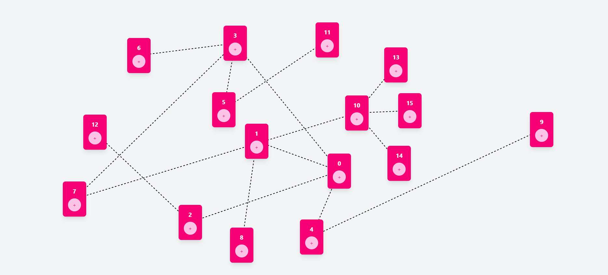

# Interactive Block and Line Connection App

This project is an interactive UI where blocks are dynamically created, draggable, and visually connected with lines. Key features include:

- Randomly Positioned Blocks: A block appears at a random position when the page loads.
- Dynamic Block Creation: Press the + button on any block to create a new child block at a random position.
- Draggable Blocks: Move blocks freely across the screen using mouse clicks.
- Parent-Child Connections: Dashed lines connect each block to its parent, forming a visual hierarchy.
- Responsive Lines: The connecting lines adjust dynamically as blocks are dragged.
- This project demonstrates creativity, state management, and precise DOM manipulation, styled using Tailwind CSS.

## This is my Application screenshot:

> 

## React + Vite

This template provides a minimal setup to get React working in Vite with HMR and some ESLint rules.

Currently, two official plugins are available:

- [@vitejs/plugin-react](https://github.com/vitejs/vite-plugin-react/blob/main/packages/plugin-react/README.md) uses [Babel](https://babeljs.io/) for Fast Refresh
- [@vitejs/plugin-react-swc](https://github.com/vitejs/vite-plugin-react-swc) uses [SWC](https://swc.rs/) for Fast Refresh
